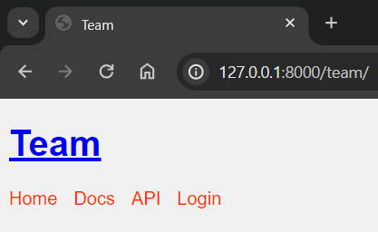
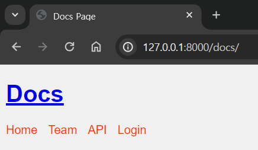
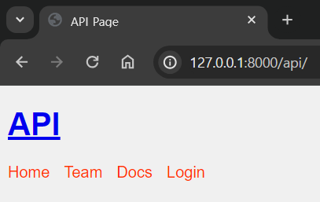
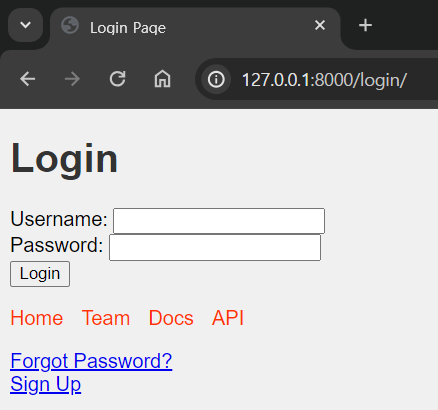
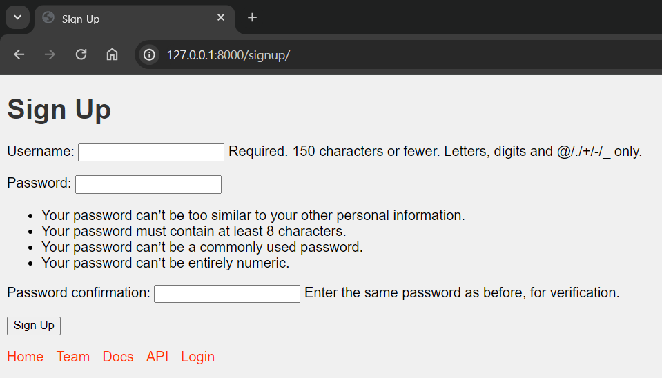
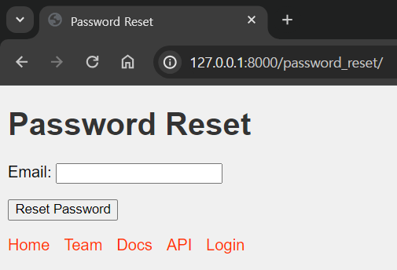
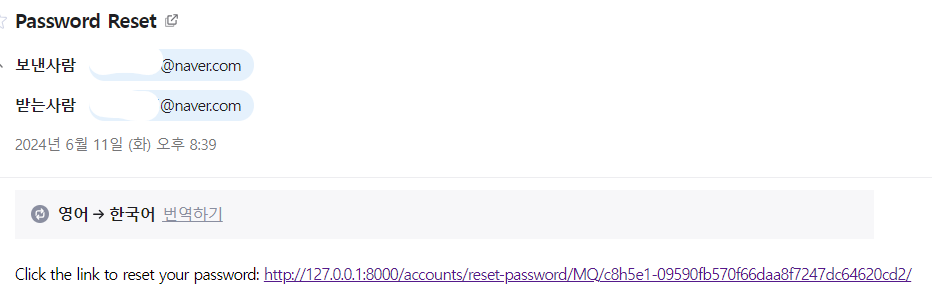
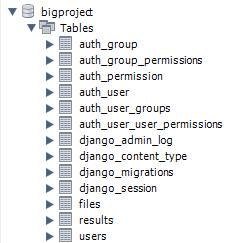

## Figma
https://www.figma.com/design/pnOrIrBw073dtnw8JY21Xk/BP_Design?node-id=0-1&t=tUDhf2oHAk4ewQh8-1

## Notion
https://www.notion.so/KT-AIVLE-School-5-8-0891388a38404f78ae8f8fd177c4def5?pvs=4

## Local에서 동작
```bash
#/bigproject 프로젝트명 확인
#작업 전 pull(최신) 여부 확인
cd bigproject
activate conda qa_system
python manage.py makemigrations
python manage.py migrate
python manage.py runserver
```

BASE_URL = http://127.0.0.1:8000/

- home

    


- team

    


- docs
    
    


- api

    


- login

    


- signup
    - 필요한 내용만 받아서 회원가능 가능하도록 수정 예정
    - 필요에 따라 소셜로그인 추가 예정
    


- pw_reset
    - id찾기, pw_reset 기능 추가 예정
    - Django에서 pw는 reset 기능만 제공
    - pw_reset기능은 reset을 위한 링크가 이메일로 발송

    
    


## MySQL 연결
- 추후 admin 역할에 따라 DB 수정 필요

    
